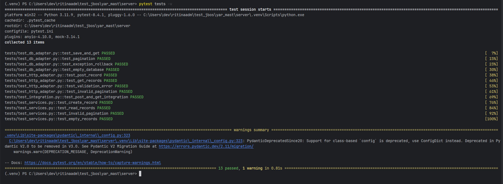

# 📌 YAR Mast — Server

Серверная часть тестового задания на **FastAPI** с использованием принципов **гексагональной архитектуры**.
Реализует REST API для сохранения и чтения записей с пагинацией.

---

## 🚀 Стек технологий

* [Python 3.12+](https://www.python.org/)
* [FastAPI](https://fastapi.tiangolo.com/) — HTTP API
* [SQLAlchemy](https://www.sqlalchemy.org/) — ORM
* [Pydantic](https://docs.pydantic.dev/) — валидация моделей
* [Uvicorn](https://www.uvicorn.org/) — ASGI сервер
* [Pytest](https://docs.pytest.org/) — тестирование
* [python-dotenv](https://pypi.org/project/python-dotenv/) — переменные окружения

---

## 📂 Структура проекта

```
server/
│── .env               # Переменные окружения (боевые)
│── .env.example       # Пример env-файла
│── main.py            # Точка входа (запуск FastAPI)
│── requirements.txt   # Зависимости с точными версиями
│── src/
│   ├── application/   # Сервисы и use cases
│   ├── domain/        # Доменные модели, порты, исключения
│   └── infrastructure/# Адаптеры, конфиг, DI
│── tests/             # Unit и integration тесты
```

---

## ⚙️ Установка и запуск

1. Клонировать репозиторий:

   ```bash
   git clone https://github.com/RitinaADM/mast_yar_server.git
   cd mast_yar_server
   ```

2. Установить зависимости:

   ```bash
   pip install -r requirements.txt
   ```

3. Создать `.env` (по примеру `.env.example`):

   ```ini
   HOST=127.0.0.1
   PORT=8000
   DB_URL=sqlite:///records.db
   ```

4. Запустить сервер:

   ```bash
   python main.py
   ```

   Сервер будет доступен по адресу:
   👉 [http://127.0.0.1:8000](http://127.0.0.1:8000)

5. Документация API доступна по адресу:
   👉 [Swagger UI](http://127.0.0.1:8000/docs)
   👉 [ReDoc](http://127.0.0.1:8000/redoc)

---

## 📡 API

### ➕ Создать запись

**POST** `/records`

```json
{
  "text": "example",
  "date": "2025-08-20",
  "time": "12:00:00",
  "click_number": 1
}
```

✅ Ответ:

```json
{"status": "success", "message": "Запись успешно создана"}
```

---

### 📖 Получить записи (с пагинацией)

**GET** `/records?page=1&limit=10`
✅ Ответ:

```json
{
  "records": [
    {
      "id": 1,
      "text": "example",
      "date": "2025-08-20",
      "time": "12:00:00",
      "click_number": 1
    }
  ],
  "total": 1
}
```

---

### 🩺 Проверка состояния

**GET** `/health`

✅ Ответ:

```json
{"status": "healthy"}
```

---

## 🧪 Тесты

Запуск тестов:

```bash
pytest tests -v
```



---

## 🔧 Улучшения качества проекта

### Версионирование зависимостей
Все зависимости в [requirements.txt](requirements.txt) теперь имеют точные версии для воспроизводимости сборки.

### Улучшенная валидация данных
- Строгая валидация форматов даты и времени
- Ограничения на длину текста и диапазоны значений
- Использование современного синтаксиса Pydantic V2

### Улучшенная обработка ошибок
- Централизованная обработка исключений
- Логирование всех операций
- Корректная обработка ошибок базы данных

### Улучшенная пагинация
- Автоматическая коррекция недопустимых параметров пагинации
- Ограничение максимального размера страницы
- Правильная сортировка записей по ID

### Улучшенные тесты
- Полное покрытие тестами всех компонентов
- Использование правильных форматов данных в тестах
- Тестирование граничных условий

---

## 🔑 Особенности реализации

* Архитектура: **Hexagonal (Ports & Adapters)**
* Полностью вынесенные конфигурации (`.env` + `settings.py`)
* Покрытие тестами: unit + integration
* Логирование запросов и ошибок
* Валидация входных данных
* Обработка ошибок на всех уровнях

---

## 👨‍💻 Автор

**@RitinaADM**
👉 [GitHub](https://github.com/RitinaADM)